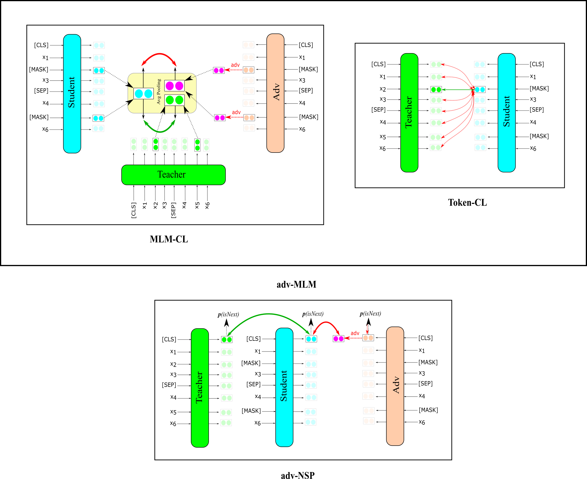

# PACT
Pretraining with Adversarial CL for Text Classification



## 1. Requirements:
```diff
python version: 3.8
pip3 install -r requirements.txt
```

## 2. Prepare Pretraining Data:

### Collect Wikipedia Dataset
```diff
pip install datasets 
```
```diff
cd pretraining_data
chmod +x ./download_raw_data.sh
./download_raw_data.sh 
```

### Tokenize Dataset

```diff
chmod +x ./tokenize_bert_uncased_data.sh
./tokenize_bert_uncased_data.sh
```

## Pretraining PACT

```diff
cd pretraining
chmod +x ./train_pact.sh
./train_pact.sh
```

## Finetuning

All the experiments on English benchmarks are conducted using huggingface transformers library. You can find the instruction to finetune our model [here](https://github.com/huggingface/transformers/tree/main/examples/pytorch/text-classification)

## Acknowledgements

Parts of the code are modified from [BERT](https://github.com/jcyk/BERT) and [TaCL](https://github.com/yxuansu/TaCL). We appreciate the authors for making it open-sourced.
